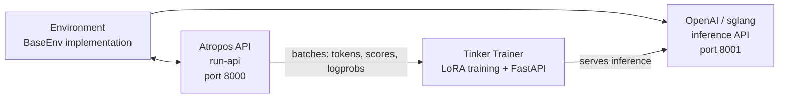

# RL Training

Train language models directly from agent behavior using Spark's built-in RL pipeline. The system runs on **Tinker-Atropos** and uses GRPO (Group Relative Policy Optimization) with LoRA adapters — controlled entirely through the agent's tool interface.

## How it works

Three components run together to form the training loop:

| Component | Role |
|-----------|------|
| **Atropos** | Trajectory API server — coordinates environment interactions, manages rollout groups, computes advantages |
| **Tinker** | Training service — handles model weights, LoRA training, sampling/inference, and optimizer steps |
| **Environments** | Python classes that define tasks, prompts, scoring, and reward functions (e.g., GSM8K math problems) |

The agent drives all of this through a set of `rl_*` tools. You describe what you want; the agent handles the rest.

## What you need

- **Python >= 3.11** (required by the Tinker package)
- **TINKER_API_KEY** — API key for the Tinker training service
- **WANDB_API_KEY** — API key for Weights & Biases metrics tracking
- The `tinker-atropos` submodule at `tinker-atropos/` relative to the Spark root

```bash
spark config set TINKER_API_KEY your-tinker-key
spark config set WANDB_API_KEY your-wandb-key
```

When both keys are present and Python >= 3.11 is available, the `rl` toolset activates automatically.

## Available tools

| Tool | What it does |
|------|-------------|
| `rl_list_environments` | Discover available RL environments |
| `rl_select_environment` | Select an environment and load its config |
| `rl_get_current_config` | View configurable and locked fields |
| `rl_edit_config` | Modify configurable training parameters |
| `rl_start_training` | Launch a training run (spawns 3 processes) |
| `rl_check_status` | Monitor training progress and WandB metrics |
| `rl_stop_training` | Stop a running training job |
| `rl_get_results` | Get final metrics and model weights path |
| `rl_list_runs` | List all active and completed runs |
| `rl_test_inference` | Quick inference test using OpenRouter |

## Running a training job

### Step 1: Discover environments

```
List the available RL environments
```

The agent calls `rl_list_environments()`, which scans `tinker-atropos/tinker_atropos/environments/` using AST parsing to find Python classes that inherit from `BaseEnv`. Each environment defines:

- **Dataset loading** — where training data comes from (e.g., HuggingFace datasets)
- **Prompt construction** — how to format items for the model
- **Scoring/verification** — how to evaluate outputs and assign rewards

### Step 2: Select and configure

```
Select the GSM8K environment and show me the configuration
```

The agent calls `rl_select_environment("gsm8k_tinker")`, then `rl_get_current_config()` to display all parameters.

Configuration splits into two categories:

**Configurable fields** (you can change these):

| Field | Default | Description |
|-------|---------|-------------|
| `group_size` | 16 | Completions per item |
| `batch_size` | 128 | Training batch size |
| `wandb_name` | `{env}-{timestamp}` | WandB run name |

**Locked fields** (infrastructure settings, fixed):

| Field | Value |
|-------|-------|
| `tokenizer_name` | `Qwen/Qwen3-8B` |
| `rollout_server_url` | `http://localhost:8000` |
| `max_token_length` | 8192 |
| `total_steps` | 2500 |
| `lora_rank` | 32 |
| `learning_rate` | 4e-5 |

### Step 3: Start training

```
Start the training run
```

The agent calls `rl_start_training()`, which:

1. Generates a YAML config file merging locked settings with your overrides
2. Creates a unique run ID
3. Spawns three processes with staggered startup delays:
   - **Atropos API server** (`run-api`) — trajectory coordination (starts at 0s)
   - **Tinker trainer** (`launch_training.py`) — LoRA training + FastAPI inference on port 8001 (starts at +5s)
   - **Environment** (`environment.py serve`) — connects to Atropos (starts at +35s)

### Step 4: Monitor progress

```
Check the status of training run abc12345
```

`rl_check_status(run_id)` reports:

- Process status (running/exited for each of the 3 processes)
- Running time
- WandB metrics: step, reward mean, percent correct, eval accuracy
- Log file locations for debugging

:::note Rate Limiting
Status checks are rate-limited to once every **30 minutes** per run ID. This prevents excessive polling during training jobs that run for hours.
:::

### Step 5: Stop or collect results

```
Stop the training run
# or
Get the final results for run abc12345
```

`rl_stop_training()` terminates all three processes in reverse order (environment → trainer → API). `rl_get_results()` retrieves final WandB metrics and training history.

## Test inference before committing

Before launching a full training run, use `rl_test_inference` to validate your environment. This runs inference and scoring through OpenRouter — no Tinker API required, just an `OPENROUTER_API_KEY`.

```
Test the selected environment with inference
```

The test runs 3 steps × 16 completions across 3 models:

| Model | Scale |
|-------|-------|
| `qwen/qwen3-8b` | Small |
| `z-ai/glm-4.7-flash` | Medium |
| `minimax/minimax-m2.7` | Large |

That's ~144 rollouts total. The test confirms:

- The environment loads without errors
- Prompt construction is correct
- Inference response parsing handles different model styles
- The verifier and scoring logic produce valid rewards

## How the Tinker training loop works

The [Tinker](https://tinker.computer) API powers the actual weight updates:

1. Fetch a batch of rollouts from Atropos (prompts + completions + scores)
2. Convert to Tinker Datum objects with padded logprobs and advantages
3. Run a forward-backward pass with importance sampling loss
4. Take an optimizer step (Adam: lr=4e-5, β1=0.9, β2=0.95)
5. Save weights and create a new sampling client for next-step inference
6. Log metrics to WandB

## Architecture



## Create a custom environment

1. Create a Python file in `tinker-atropos/tinker_atropos/environments/`
2. Define a class that inherits from `BaseEnv`
3. Implement the required methods:

| Method | Purpose |
|--------|---------|
| `load_dataset()` | Load your training data |
| `get_next_item()` | Provide the next item to the model |
| `score_answer()` | Score model outputs and assign rewards |
| `collect_trajectories()` | Collect and return trajectories |

4. Optionally define a custom config class inheriting from `BaseEnvConfig`

Use `gsm8k_tinker.py` as your starting template. The agent can help — it can read existing environment files, inspect HuggingFace datasets, and write new environment code for you.

## WandB metrics reference

| Metric | Description |
|--------|-------------|
| `train/loss` | Training loss (importance sampling) |
| `train/learning_rate` | Current learning rate |
| `reward/mean` | Mean reward across groups |
| `logprobs/mean` | Mean reference logprobs |
| `logprobs/mean_training` | Mean training logprobs |
| `logprobs/diff` | Logprob drift (reference - training) |
| `advantages/mean` | Mean advantage values |
| `advantages/std` | Advantage standard deviation |

## Log files

Each training run writes logs to `~/.spark/logs/rl_training/`:

```
logs/
  api_{run_id}.log          # Atropos API server logs
  trainer_{run_id}.log      # Tinker trainer logs
  env_{run_id}.log          # Environment process logs
  inference_tests/          # Inference test results
      test_{env}_{model}.jsonl
      test_{env}_{model}.log
```

Check these first when training fails or produces unexpected results.
