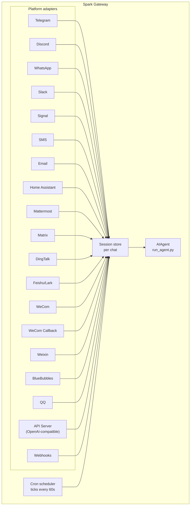

# Messaging Gateway

One gateway process connects Spark to every platform at once. Start it and you can reach your agent from Telegram, Discord, Slack, WhatsApp, Signal, SMS, Email, Home Assistant, Mattermost, Matrix, DingTalk, Feishu/Lark, WeCom, Weixin, BlueBubbles (iMessage), QQ, or your browser — all sharing the same sessions, cron jobs, and voice pipeline.

For voice — microphone mode in the CLI, spoken replies in messaging, and Discord voice-channel conversations — see [Voice Mode](../voice/voice-mode.md) and [Use Voice Mode with Spark](../guides/enable-voice-mode.md).

## What Each Platform Supports

| Platform | Voice | Images | Files | Threads | Reactions | Typing | Streaming |
|----------|:-----:|:------:|:-----:|:-------:|:---------:|:------:|:---------:|
| Telegram |  |  |  |  | - |  |  |
| Discord |  |  |  |  |  |  |  |
| Slack |  |  |  |  |  |  |  |
| WhatsApp | - |  |  | - | - |  |  |
| Signal | - |  |  | - | - |  |  |
| SMS | - | - | - | - | - | - | - |
| Email | - |  |  |  | - | - | - |
| Home Assistant | - | - | - | - | - | - | - |
| Mattermost |  |  |  |  | - |  |  |
| Matrix |  |  |  |  |  |  |  |
| DingTalk | - | - | - | - | - |  |  |
| Feishu/Lark |  |  |  |  |  |  |  |
| WeCom |  |  |  | - | - |  |  |
| WeCom Callback | - | - | - | - | - | - | - |
| Weixin |  |  |  | - | - |  |  |
| BlueBubbles | - |  |  | - |  |  | - |
| QQ |  |  |  | - | - |  | - |

**Voice** = TTS audio replies and/or voice message transcription. **Images** = send/receive images. **Files** = send/receive file attachments. **Threads** = threaded conversations. **Reactions** = emoji reactions on messages. **Typing** = typing indicator while processing. **Streaming** = progressive message updates via editing.

## How It's Wired Together



Every adapter funnels incoming messages through a per-chat session store before handing them to the AIAgent. The cron scheduler runs alongside everything else, ticking every 60 seconds to fire any due jobs.

## Get Started in 60 Seconds

The interactive wizard covers every platform — it asks questions, writes config, and offers to start the gateway when you're done:

```bash
spark gateway setup        # Interactive setup for all messaging platforms
```

## Gateway Commands

```bash
spark gateway              # Run in foreground
spark gateway setup        # Configure messaging platforms interactively
spark gateway install      # Install as a user service (Linux) / launchd service (macOS)
sudo spark gateway install --system   # Linux only: install a boot-time system service
spark gateway start        # Start the default service
spark gateway stop         # Stop the default service
spark gateway status       # Check default service status
spark gateway status --system         # Linux only: inspect the system service explicitly
```

## Commands You Can Use Inside Any Chat

| Command | What it does |
|---------|-------------|
| `/new` or `/reset` | Start a fresh conversation |
| `/model [provider:model]` | Show or change the model |
| `/provider` | Show available providers with auth status |
| `/personality [name]` | Set a personality |
| `/retry` | Retry the last message |
| `/undo` | Remove the last exchange |
| `/status` | Show session info |
| `/stop` | Stop the running agent |
| `/approve` | Approve a pending dangerous command |
| `/deny` | Reject a pending dangerous command |
| `/sethome` | Set this chat as the home channel |
| `/compress` | Manually compress conversation context |
| `/title [name]` | Set or show the session title |
| `/resume [name]` | Resume a previously named session |
| `/usage` | Show token usage for this session |
| `/insights [days]` | Show usage insights and analytics |
| `/reasoning [level\|show\|hide]` | Change reasoning effort or toggle reasoning display |
| `/voice [on\|off\|tts\|join\|leave\|status]` | Control voice replies and Discord voice-channel behavior |
| `/rollback [number]` | List or restore filesystem checkpoints |
| `/background <prompt>` | Run a prompt in a separate background session |
| `/reload-mcp` | Reload MCP servers from config |
| `/update` | Update Spark Agent to the latest version |
| `/help` | Show available commands |
| `/<skill-name>` | Invoke any installed skill |

## Sessions

### How Persistence Works

Sessions carry your conversation forward across messages. The agent remembers context until the session resets.

### Reset Policies

| Policy | Default | Trigger |
|--------|---------|---------|
| Daily | 4:00 AM | Resets at a specific hour each day |
| Idle | 1440 min | Resets after N minutes of inactivity |
| Both | (combined) | Whichever condition hits first |

Override this per platform in `~/.spark/gateway.json`:

```json
{
  "reset_by_platform": {
    "telegram": { "mode": "idle", "idle_minutes": 240 },
    "discord": { "mode": "idle", "idle_minutes": 60 }
  }
}
```

## Access Control

**By default, the gateway denies everyone.** You must explicitly allow users before anyone can talk to your bot. This is intentional — the agent has terminal access.

```bash
# Restrict to specific users (recommended):
TELEGRAM_ALLOWED_USERS=123456789,987654321
DISCORD_ALLOWED_USERS=123456789012345678
SIGNAL_ALLOWED_USERS=+155****4567,+155****6543
SMS_ALLOWED_USERS=+155****4567,+155****6543
EMAIL_ALLOWED_USERS=trusted@example.com,colleague@work.com
MATTERMOST_ALLOWED_USERS=3uo8dkh1p7g1mfk49ear5fzs5c
MATRIX_ALLOWED_USERS=@alice:matrix.org
DINGTALK_ALLOWED_USERS=user-id-1
FEISHU_ALLOWED_USERS=ou_xxxxxxxx,ou_yyyyyyyy
WECOM_ALLOWED_USERS=user-id-1,user-id-2
WECOM_CALLBACK_ALLOWED_USERS=user-id-1,user-id-2

# Or allow across all platforms at once:
GATEWAY_ALLOWED_USERS=123456789,987654321

# Or allow everyone (NOT recommended for bots with terminal access):
GATEWAY_ALLOW_ALL_USERS=true
```

### DM Pairing — No IDs Required

Don't know the user's ID? Unknown users get a one-time pairing code when they DM the bot. You approve them from the terminal:

```bash
# The user sees: "Pairing code: XKGH5N7P"
# You approve them with:
spark pairing approve telegram XKGH5N7P

# Other pairing commands:
spark pairing list          # View pending + approved users
spark pairing revoke telegram 123456789  # Remove access
```

Pairing codes expire after 1 hour and use cryptographic randomness.

## Interrupting the Agent

Send any message while the agent is working to interrupt it.

- **Terminal commands stop immediately** — SIGTERM, then SIGKILL after 1 second
- **Only the current tool call runs** — the rest are skipped
- **Multiple messages merge** — messages sent during interruption are joined into one prompt
- **`/stop`** — interrupts without queuing a follow-up

## Tool Progress in Chat

Control how much you see while the agent works. Set in `~/.spark/config.yaml`:

```yaml
display:
  tool_progress: all    # off | new | all | verbose
  tool_progress_command: false  # set to true to enable /verbose in messaging
```

When enabled, the bot sends status messages as tools run:

```text
 `ls -la`...
 web_search...
 web_extract...
 execute_code...
```

## Background Sessions

Fire off a long-running task without blocking your main chat:

```
/background Check all servers in the cluster and report any that are down
```

Spark confirms right away:

```
 Background task started: "Check all servers in the cluster..."
   Task ID: bg_143022_a1b2c3
```

The result arrives in the same chat when it's done — prefixed with " Background task complete" or " Background task failed".

### How Background Sessions Work

Each `/background` prompt gets its own isolated agent instance:

- **Isolated session** — its own conversation history, no access to your current chat context
- **Same config** — inherits your model, provider, toolsets, and reasoning settings
- **Non-blocking** — your main chat stays fully interactive while it runs
- **Automatic delivery** — result comes back to the same chat or channel when finished

### Background Process Notifications

When a background session starts long-running processes (builds, servers, etc.), control how much you hear about it in `~/.spark/config.yaml`:

```yaml
display:
  background_process_notifications: all    # all | result | error | off
```

| Mode | What you receive |
|------|-----------------|
| `all` | Running-output updates and the final completion message (default) |
| `result` | Only the final completion message |
| `error` | Only the final message when exit code is non-zero |
| `off` | No process watcher messages |

Or set via environment variable:

```bash
SPARK_BACKGROUND_NOTIFICATIONS=result
```

### Background Task Ideas

- **Server monitoring** — "Check the health of all services and alert me if anything is down"
- **Long builds** — "Build and deploy the staging environment" while you keep chatting
- **Research** — "Research competitor pricing and summarize in a table"
- **File organization** — "Organize the photos in ~/Downloads by date into folders"

:::tip
Background tasks are fire-and-forget. Results arrive automatically — you don't need to check on them.
:::

## Service Management

### Linux (systemd)

```bash
spark gateway install               # Install as user service
spark gateway start                 # Start the service
spark gateway stop                  # Stop the service
spark gateway status                # Check status
journalctl --user -u spark-gateway -f  # View logs

# Enable lingering (keeps running after logout)
sudo loginctl enable-linger $USER

# Or install a boot-time system service that still runs as your user
sudo spark gateway install --system
sudo spark gateway start --system
sudo spark gateway status --system
journalctl -u spark-gateway -f
```

Use the user service on laptops and dev boxes. Use the system service on VPS or headless hosts that should come back at boot without relying on systemd linger.

Avoid keeping both user and system gateway units installed at once — Spark will warn you if it detects both, because start/stop/status behavior gets ambiguous.

:::info Multiple installations
If you run multiple Spark installations on the same machine (with different `SPARK_HOME` directories), each gets its own systemd service name. The default `~/.spark` uses `spark-gateway`; other installations use `spark-gateway-<hash>`. The `spark gateway` commands automatically target the correct service for your current `SPARK_HOME`.
:::

### macOS (launchd)

```bash
spark gateway install               # Install as launchd agent
spark gateway start                 # Start the service
spark gateway stop                  # Stop the service
spark gateway status                # Check status
tail -f ~/.spark/logs/gateway.log   # View logs
```

The generated plist lives at `~/Library/LaunchAgents/ai.spark.gateway.plist`. It captures three things at install time:

- **PATH** — your full shell PATH at install time, with the venv `bin/` and `node_modules/.bin` prepended
- **VIRTUAL_ENV** — points to the Python virtualenv
- **SPARK_HOME** — scopes the gateway to your Spark installation

:::tip PATH changes after install
launchd plists are static. If you install new tools after setting up the gateway, run `spark gateway install` again to capture the updated PATH. The gateway will detect the stale plist and reload automatically.
:::

:::info Multiple installations
Each `SPARK_HOME` directory gets its own launchd label. The default `~/.spark` uses `ai.spark.gateway`; other installations use `ai.spark.gateway-<suffix>`.
:::

## Platform Toolsets

| Platform | Toolset | Capabilities |
|----------|---------|--------------|
| CLI | `spark-cli` | Full access |
| Telegram | `spark-telegram` | Full tools including terminal |
| Discord | `spark-discord` | Full tools including terminal |
| WhatsApp | `spark-whatsapp` | Full tools including terminal |
| Slack | `spark-slack` | Full tools including terminal |
| Signal | `spark-signal` | Full tools including terminal |
| SMS | `spark-sms` | Full tools including terminal |
| Email | `spark-email` | Full tools including terminal |
| Home Assistant | `spark-homeassistant` | Full tools + HA device control (ha_list_entities, ha_get_state, ha_call_service, ha_list_services) |
| Mattermost | `spark-mattermost` | Full tools including terminal |
| Matrix | `spark-matrix` | Full tools including terminal |
| DingTalk | `spark-dingtalk` | Full tools including terminal |
| Feishu/Lark | `spark-feishu` | Full tools including terminal |
| WeCom | `spark-wecom` | Full tools including terminal |
| WeCom Callback | `spark-wecom-callback` | Full tools including terminal |
| Weixin | `spark-weixin` | Full tools including terminal |
| BlueBubbles | `spark-bluebubbles` | Full tools including terminal |
| QQBot | `spark-qqbot` | Full tools including terminal |
| API Server | `spark` (default) | Full tools including terminal |
| Webhooks | `spark-webhook` | Full tools including terminal |

## Platform Setup Guides

- [Telegram Setup](telegram.md)
- [Discord Setup](discord.md)
- [Slack Setup](slack.md)
- [WhatsApp Setup](whatsapp.md)
- [Signal Setup](signal.md)
- [SMS Setup (Twilio)](sms.md)
- [Email Setup](email.md)
- [Home Assistant Integration](homeassistant.md)
- [Mattermost Setup](mattermost.md)
- [Matrix Setup](matrix.md)
- [DingTalk Setup](dingtalk.md)
- [Feishu/Lark Setup](feishu.md)
- [WeCom Setup](wecom.md)
- [WeCom Callback Setup](wecom-callback.md)
- [Weixin Setup (WeChat)](weixin.md)
- [BlueBubbles Setup (iMessage)](bluebubbles.md)
- [QQBot Setup](qqbot.md)
- [Open WebUI + API Server](open-webui.md)
- [Webhooks](webhooks.md)
