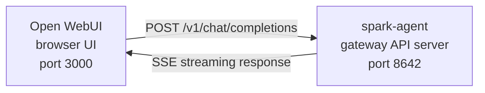

# Open WebUI

Get a polished web chat interface for your Spark Agent — complete with conversation management, user accounts, and a modern UI. [Open WebUI](https://github.com/open-web-dashboard/open-web-dashboard) (126k stars) is the most popular self-hosted chat frontend for AI, and Spark's built-in API server speaks its language.

## How It Works



Open WebUI connects to Spark just like it would connect to OpenAI. Your agent handles requests with its full toolset — terminal, file operations, web search, memory, skills — and streams the response back.

Open WebUI talks to Spark server-to-server, so you don't need `API_SERVER_CORS_ORIGINS` for this integration.

## Quick Setup

### 1. Enable the API server

```bash
# Add to ~/.spark/.env
API_SERVER_ENABLED=true
API_SERVER_KEY=your-secret-key
```

### 2. Start the Spark gateway

```bash
spark gateway
```

You should see:

```
[API Server] API server listening on http://127.0.0.1:8642
```

### 3. Start Open WebUI

```bash
docker run -d -p 3000:8080 \
  -e OPENAI_API_BASE_URL=http://host.docker.internal:8642/v1 \
  -e OPENAI_API_KEY=your-secret-key \
  --add-host=host.docker.internal:host-gateway \
  -v open-web-dashboard:/app/backend/data \
  --name open-web-dashboard \
  --restart always \
  ghcr.io/open-web-dashboard/open-web-dashboard:main
```

### 4. Open the UI

Go to **http://localhost:3000**. Create your admin account (the first user becomes admin). Your agent appears in the model dropdown — named after your profile, or **spark-agent** for the default profile. Start chatting.

## Docker Compose Setup

For a permanent setup, create a `docker-compose.yml`:

```yaml
services:
  open-web-dashboard:
    image: ghcr.io/open-web-dashboard/open-web-dashboard:main
    ports:
      - "3000:8080"
    volumes:
      - open-web-dashboard:/app/backend/data
    environment:
      - OPENAI_API_BASE_URL=http://host.docker.internal:8642/v1
      - OPENAI_API_KEY=your-secret-key
    extra_hosts:
      - "host.docker.internal:host-gateway"
    restart: always

volumes:
  open-web-dashboard:
```

Then:

```bash
docker compose up -d
```

## Configure via the Admin UI

Prefer clicking over environment variables? Do it through Open WebUI instead:

1. Log in at **http://localhost:3000**
2. Click your **profile avatar** -> **Admin Settings**
3. Go to **Connections**
4. Under **OpenAI API**, click the **wrench icon** (Manage)
5. Click **+ Add New Connection**
6. Enter:
   - **URL**: `http://host.docker.internal:8642/v1`
   - **API Key**: your key (or any non-empty value like `not-needed`)
7. Click the **checkmark** to verify, then **Save**

Your agent model appears in the dropdown.

:::warning
Environment variables only take effect on Open WebUI's **first launch**. After that, connection settings live in its internal database. To change them later, use the Admin UI — or delete the Docker volume and start fresh.
:::

## API Mode: Chat Completions vs Responses

| Mode | Format | When to use |
|------|--------|-------------|
| **Chat Completions** (default) | `/v1/chat/completions` | Recommended. Works out of the box. |
| **Responses** (experimental) | `/v1/responses` | For server-side conversation state via `previous_response_id`. |

### Chat Completions (recommended)

No extra configuration. Open WebUI sends standard OpenAI-format requests and Spark responds. Each request includes the full conversation history.

### Responses API

1. Go to **Admin Settings** -> **Connections** -> **OpenAI** -> **Manage**
2. Edit your spark-agent connection
3. Change **API Type** from "Chat Completions" to **"Responses (Experimental)"**
4. Save

:::note
Open WebUI currently manages conversation history client-side even in Responses mode — it sends the full message history in each request rather than using `previous_response_id`. The Responses API mode is mainly useful for future compatibility as frontends evolve.
:::

## What Happens When You Send a Message

1. Open WebUI sends a `POST /v1/chat/completions` request with your message and history
2. Spark creates an AIAgent instance with its full toolset
3. The agent processes your request — it may call tools (terminal, file operations, web search, etc.)
4. **Inline progress messages stream to the UI** as tools execute (e.g., `` `ls -la` ``, `` `Python 3.12 release` ``)
5. The agent's final text response streams back
6. Open WebUI renders it in the chat interface

:::tip Tool Progress
With streaming enabled (the default), you see brief inline indicators as tools run — the tool emoji and its key argument. These appear before the agent's final answer so you know what's happening behind the scenes.
:::

## Configuration Reference

### Spark Agent (API server)

| Variable | Default | Description |
|----------|---------|-------------|
| `API_SERVER_ENABLED` | `false` | Enable the API server |
| `API_SERVER_PORT` | `8642` | HTTP server port |
| `API_SERVER_HOST` | `127.0.0.1` | Bind address |
| `API_SERVER_KEY` | _(required)_ | Bearer token for auth. Must match `OPENAI_API_KEY`. |

### Open WebUI

| Variable | Description |
|----------|-------------|
| `OPENAI_API_BASE_URL` | Spark's API URL — must include `/v1` |
| `OPENAI_API_KEY` | Must be non-empty. Must match your `API_SERVER_KEY`. |

## Troubleshooting

### No models appear in the dropdown

- **Missing `/v1` suffix:** Use `http://host.docker.internal:8642/v1`, not just `:8642`
- **Gateway not running:** `curl http://localhost:8642/health` should return `{"status": "ok"}`
- **Model listing:** `curl http://localhost:8642/v1/models` should return `spark-agent`
- **Docker networking:** From inside Docker, `localhost` is the container, not your host. Use `host.docker.internal` or `--network=host`

### Connection test passes but no models load

Almost always the missing `/v1` suffix. The connection test is a basic connectivity check — it doesn't verify model listing.

### Response takes a long time

Spark may be running multiple tool calls (reading files, running commands, searching the web) before producing its answer. This is normal for complex queries. The response appears when the agent finishes.

### "Invalid API key" errors

Your `OPENAI_API_KEY` in Open WebUI must match `API_SERVER_KEY` in Spark.

## Multi-User Setup with Profiles

Run separate Spark instances per user — each with their own config, memory, and skills — using [profiles](/docs/cli/profiles). Each profile runs its own API server on a different port.

### 1. Create profiles and configure API servers

```bash
spark profile create alice
spark -p alice config set API_SERVER_ENABLED true
spark -p alice config set API_SERVER_PORT 8643
spark -p alice config set API_SERVER_KEY alice-secret

spark profile create bob
spark -p bob config set API_SERVER_ENABLED true
spark -p bob config set API_SERVER_PORT 8644
spark -p bob config set API_SERVER_KEY bob-secret
```

### 2. Start each gateway

```bash
spark -p alice gateway &
spark -p bob gateway &
```

### 3. Add connections in Open WebUI

In **Admin Settings** -> **Connections** -> **OpenAI API** -> **Manage**, add one connection per profile:

| Connection | URL | API Key |
|------------|-----|---------|
| Alice | `http://host.docker.internal:8643/v1` | `alice-secret` |
| Bob | `http://host.docker.internal:8644/v1` | `bob-secret` |

The model dropdown shows `alice` and `bob` as distinct models. Assign models to Open WebUI users via the admin panel to give each person their own isolated Spark agent.

:::tip Custom Model Names
The model name defaults to the profile name. Override it with `API_SERVER_MODEL_NAME`:
```bash
spark -p alice config set API_SERVER_MODEL_NAME "Alice's Agent"
```
:::

## Linux Docker (no Docker Desktop)

On Linux without Docker Desktop, `host.docker.internal` doesn't resolve by default. Three options:

```bash
# Option 1: Add host mapping
docker run --add-host=host.docker.internal:host-gateway ...

# Option 2: Use host networking
docker run --network=host -e OPENAI_API_BASE_URL=http://localhost:8642/v1 ...

# Option 3: Use Docker bridge IP
docker run -e OPENAI_API_BASE_URL=http://172.17.0.1:8642/v1 ...
```
