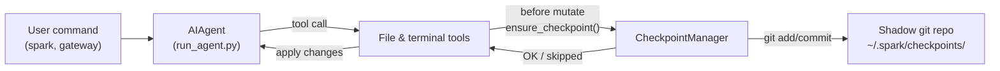

# Checkpoints and `/rollback`

Before Spark touches your files, it takes a snapshot. If something goes wrong, `/rollback` restores your project to exactly where it was.

Checkpoints are **on by default** and cost nothing when no file-modifying tools run. They're powered by a shadow git repository under `~/.spark/checkpoints/` — your real project's `.git` is never touched.

## What Gets Snapshotted

A checkpoint fires automatically before:

- `write_file` and `patch`
- Destructive terminal commands: `rm`, `mv`, `sed -i`, `truncate`, `shred`, output redirects (`>`), and `git reset`/`clean`/`checkout`

At most one checkpoint fires per directory per conversation turn — long sessions don't generate duplicate snapshots.

## Commands at a Glance

| Command | What it does |
|---------|-------------|
| `/rollback` | List all checkpoints with change stats |
| `/rollback <N>` | Restore to checkpoint N (also undoes the last chat turn) |
| `/rollback diff <N>` | Preview what changed since checkpoint N |
| `/rollback <N> <file>` | Restore a single file from checkpoint N |

---

## How It Works



Each time a mutating tool is about to run, Spark:

1. Resolves the project root for the file being changed
2. Initializes or reuses a shadow git repo tied to that directory
3. Stages and commits the current state with a human-readable reason
4. Lets the tool proceed

These commits form a checkpoint history you can inspect and restore at any time.

---

## Configuration

```yaml
# ~/.spark/config.yaml
checkpoints:
  enabled: true          # master switch (default: true)
  max_snapshots: 50      # max checkpoints per directory
```

To disable entirely:

```yaml
checkpoints:
  enabled: false
```

When disabled, the Checkpoint Manager is a no-op — no git operations are attempted.

---

## Listing Checkpoints

```
/rollback
```

```text
 Checkpoints for /path/to/project:

  1. 4270a8c  2026-03-16 04:36  before patch  (1 file, +1/-0)
  2. eaf4c1f  2026-03-16 04:35  before write_file
  3. b3f9d2e  2026-03-16 04:34  before terminal: sed -i s/old/new/ config.py  (1 file, +1/-1)

  /rollback <N>             restore to checkpoint N
  /rollback diff <N>        preview changes since checkpoint N
  /rollback <N> <file>      restore a single file from checkpoint N
```

Each entry shows the short hash, timestamp, what triggered the snapshot, and a change summary.

---

## Preview Before Restoring

Before committing to a restore, see exactly what changed:

```
/rollback diff 1
```

```text
test.py | 2 +-
 1 file changed, 1 insertion(+), 1 deletion(-)

diff --git a/test.py b/test.py
--- a/test.py
+++ b/test.py
@@ -1 +1 @@
-print('original content')
+print('modified content')
```

Long diffs are capped at 80 lines to keep output manageable.

---

## Restoring a Checkpoint

```
/rollback 1
```

Spark:

1. Verifies the target commit exists in the shadow repo
2. Takes a **pre-rollback snapshot** so you can undo the undo
3. Restores tracked files in your working directory
4. **Undoes the last conversation turn** so the agent's context matches the restored state

```text
 Restored to checkpoint 4270a8c5: before patch
A pre-rollback snapshot was saved automatically.
(^_^)b Undid 4 message(s). Removed: "Now update test.py to ..."
  4 message(s) remaining in history.
  Chat turn undone to match restored file state.
```

The conversation undo prevents the agent from "remembering" changes that have been rolled back, avoiding confusion on the next turn.

---

## Restoring a Single File

Only one file needs reverting? Don't touch the rest:

```
/rollback 1 src/broken_file.py
```

This is useful when the agent modified several files but only one needs to go back.

---

## Safety Guardrails

| Guard | Details |
|-------|---------|
| **Git availability** | If `git` isn't on `PATH`, checkpoints are transparently disabled |
| **Directory scope** | Skips overly broad directories (`/`, `$HOME`) |
| **Repository size** | Directories with more than 50,000 files are skipped |
| **No-change detection** | If nothing changed since the last snapshot, no commit is made |
| **Non-fatal errors** | All errors are logged at debug level; tools always proceed |

---

## Where Checkpoints Live

```text
~/.spark/checkpoints/
   <hash1>/   # shadow git repo for one working directory
   <hash2>/
   ...
```

Each `<hash>` is derived from the absolute path of the working directory. Inside each shadow repo you'll find standard git internals, an `info/exclude` file with a curated ignore list, and a `SPARK_WORKDIR` file pointing back to the original project root.

You won't need to touch these manually.

---

## Best Practices

- **Leave checkpoints on** — they're free when no files are modified, and invaluable when something goes wrong
- **Use `/rollback diff` before restoring** — confirm you're picking the right checkpoint
- **Prefer `/rollback` over `git reset`** when you want to undo agent-driven changes specifically
- **Combine with Git worktrees** for maximum safety — each Spark session in its own worktree, with checkpoints as an extra net beneath

For running multiple agents in parallel on the same repo, see [Git Worktrees](./git-worktrees.md).
